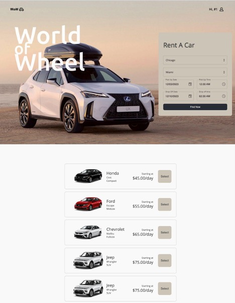
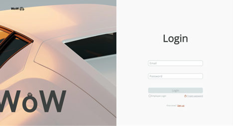
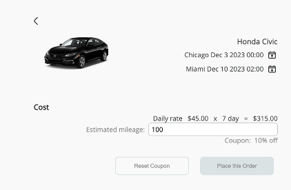
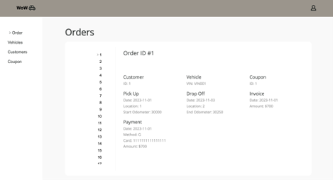

# WOW (World on Wheels) - Centralized Database & Website Development

## Contents

- <a href="#introduction">Introduction</a>
- <a href="#approach">Approach</a>
- <a href="#technology-stack">Technology Stack</a>
- <a href="#business-impact">Business Impact</a>
- <a href="#security-measures">Security Measures</a>
- <a href="#screenshots">Screenshots</a>

## Introduction

WOW is a growing car rental company transitioning to a centralized database system for streamlined operations, enhanced customer service, and improved decision-making.

## Approach

- **Identified key entities:** Customer, Vehicle, Rental Service, Invoice, and Payment.
- Designed a relational model for efficient data management.
- Implemented SQL commands to optimize search efficiency.

## Technology Stack

- **Database Management:** MySQL, SQL for queries
- **Website Development:** React, Node.js, HTML, CSS, JavaScript

## Business Impact

- **Efficient Data Management:** Centralized database for streamlined operations.
- **Enhanced Customer Service:** User-centric website for improved interactions.
- **Data-Driven Decisions:** Insights from the database for strategic planning.
- **Scalability:** A robust foundation for future growth.

## Security Measures

- **Logging and Monitoring:** Tracking and identifying potential security breaches.
- **Authorization Controls:** Role-based access for data security.
- **Input Validation:** Filtering and validating user inputs to prevent malicious attacks.
- **Error Handling:** Graceful handling of errors to maintain system integrity.
- **Data Encryption:** Industry-standard encryption for safeguarding sensitive information.

## Screenshots

  
  
  
  
  
  
  

